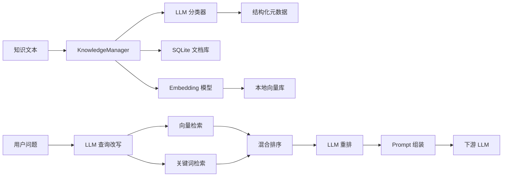
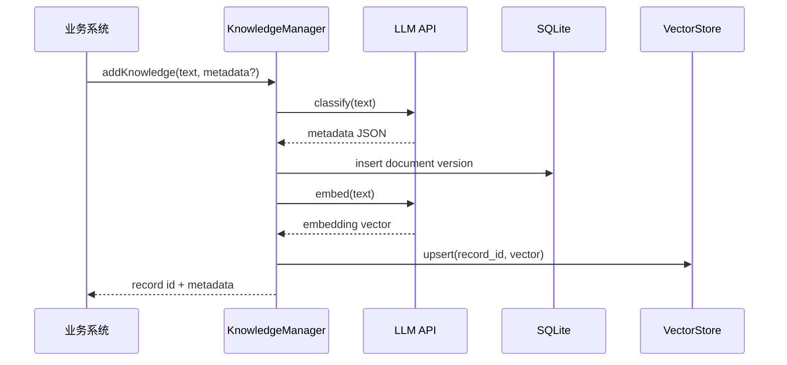
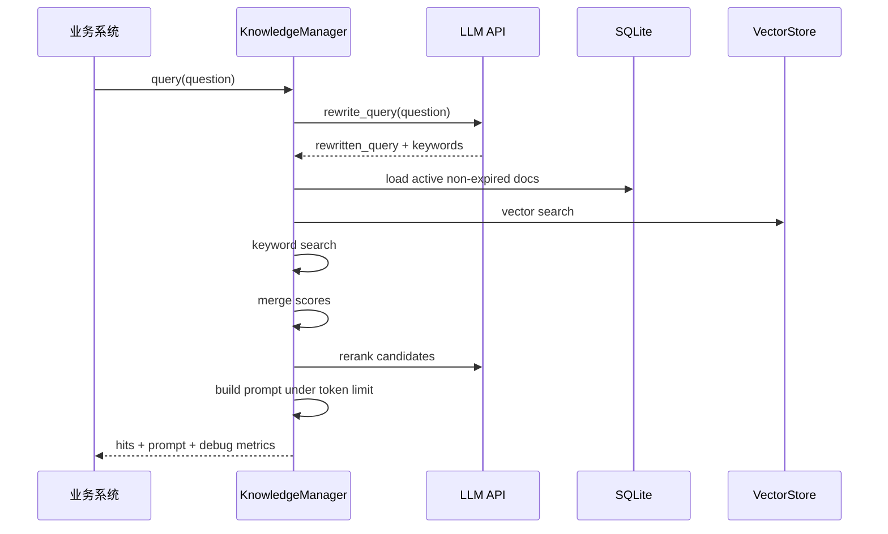

# 智能知识库管理与检索组件方案设计

## 1. 目标与边界

目标是实现一个轻量级智能知识库组件，为智能客服、产品问答、内部知识助手等 RAG 应用提供统一的知识入库和检索能力。

核心能力：

- 智能分类：使用 LLM 为纯文本/Markdown 生成结构化元数据。
- 存储管理：保存原文、元数据、版本、过期时间和向量。
- 智能检索：使用关键词 + 向量混合召回，并组装下游 LLM Prompt。

边界：

- 只处理纯文本/Markdown，不解析 PDF、Word。
- 不直接实现完整聊天机器人，只返回检索结果和 Prompt。
- 默认本地轻量部署，后续可替换为 Chroma、FAISS、Milvus 等向量库。

## 2. 整体架构



## 3. 入库流程



## 4. 查询流程



## 5. 分类设计

### 分类维度

| 字段 | 说明 |
| --- | --- |
| `business_domain` | 业务域，如 customer_service、product、policy、technical、finance |
| `knowledge_type` | 知识类型，如 faq、policy、procedure、case、product_doc |
| `importance` | 重要程度，low、medium、high |
| `expire_at` | 过期时间，无法判断时为 null |
| `tags` | 关键词标签 |
| `summary` | 一句话摘要 |
| `confidence` | 分类置信度 |
| `needs_review` | 低置信度时进入人工复核 |

### Prompt 策略

分类 Prompt 要求 LLM 只返回严格 JSON，避免自然语言解释。低于 `0.65` 的分类置信度标记 `needs_review=true`。人工传入的 metadata 会覆盖模型分类结果，方便业务系统保留来源、负责人、权限等字段。

Prompt 模板位于 `src/knowledge_base/llm/prompts.py`。

## 6. 存储结构设计

### SQLite 文档表

```sql
CREATE TABLE knowledge_documents (
  id TEXT PRIMARY KEY,
  logical_id TEXT NOT NULL,
  version INTEGER NOT NULL,
  text TEXT NOT NULL,
  metadata_json TEXT NOT NULL,
  status TEXT NOT NULL,
  created_at TEXT NOT NULL,
  updated_at TEXT NOT NULL
);
```

字段说明：

- `id`：版本级唯一 ID，格式为 `{logical_id}:v{version}`。
- `logical_id`：同一知识的稳定 ID。
- `version`：版本号，更新时自增。
- `text`：原始文本。
- `metadata_json`：分类元数据和人工补充字段。
- `status`：`active` 或 `deleted`。
- `created_at` / `updated_at`：审计字段。

### 向量存储

当前实现使用 `data/vectors.json` 保存 `{record_id: embedding}`。选择理由：

- 零部署，适合课程/实习题目快速验收。
- 逻辑透明，便于说明向量检索原理。
- 后续可无缝替换为 Chroma、FAISS 或 Milvus。

### 版本管理

每次更新同一个 `logical_id` 时生成新版本。检索只召回每个 `logical_id` 的最新 active 版本，历史版本保留用于审计和回滚。

### 过期机制

元数据中的 `expire_at` 小于当前日期时，默认不参与检索。过期文档仍保存在库中。

## 7. 检索策略

### 查询改写

调用 LLM 将用户问题改写成独立、清晰的检索问题，并提取关键词。无 API Key 时直接使用原问题和本地关键词抽取。

### 混合召回

系统同时执行：

- 向量检索：适合语义相近但措辞不同的问题。
- 关键词检索：适合产品名、错误码、制度编号、专有名词。

合并分数：

```text
final_score = 0.65 * vector_score + 0.35 * keyword_score
```

### 重排

当配置 LLM API 时，将候选结果交给 LLM 做相关性重排。没有 API Key 时按混合分数排序。

### Prompt 组装

Prompt 组装包含：

- 用户问题。
- 来源编号、业务域、知识类型、分数、标签。
- 检索到的知识正文。

Token 控制采用估算法：英文约 4 字符一个 token，中文约 2 字符一个 token。超过上限的片段会被跳过。

## 8. 可观测性

当前记录：

- 入库耗时。
- 分类置信度。
- 是否需要人工复核。
- 查询耗时。
- 命中文档数量。
- Prompt 估算 token 数。

后续可以扩展为日志文件、Prometheus 指标或 OpenTelemetry Trace。

## 9. 选型理由

| 选型 | 理由 |
| --- | --- |
| Python | RAG 原型和验证效率高，生态成熟 |
| SQLite | 轻量、无需服务部署，Schema 清楚 |
| 本地 JSON 向量库 | 便于演示，降低环境依赖 |
| OpenAI-compatible API | 可接入 OpenAI、通义、智谱、DeepSeek 等兼容接口 |
| fallback 模式 | 没有 API Key 时仍能完成端到端演示 |

## 10. 后续优化

- 使用 Chroma/FAISS 替换本地 JSON 向量库。
- 实现 HyDE：先生成假设答案再检索。
- 支持知识冲突检测。
- 根据人工反馈动态调整分类规则。
- 增加 Web API，例如 FastAPI。
- 引入更严格的 tokenizer 和 Prompt 压缩策略。
