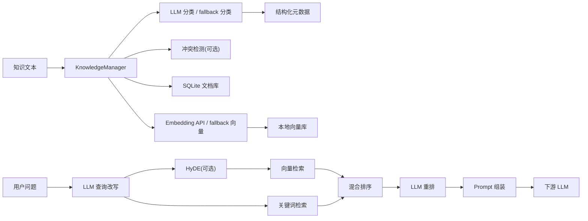
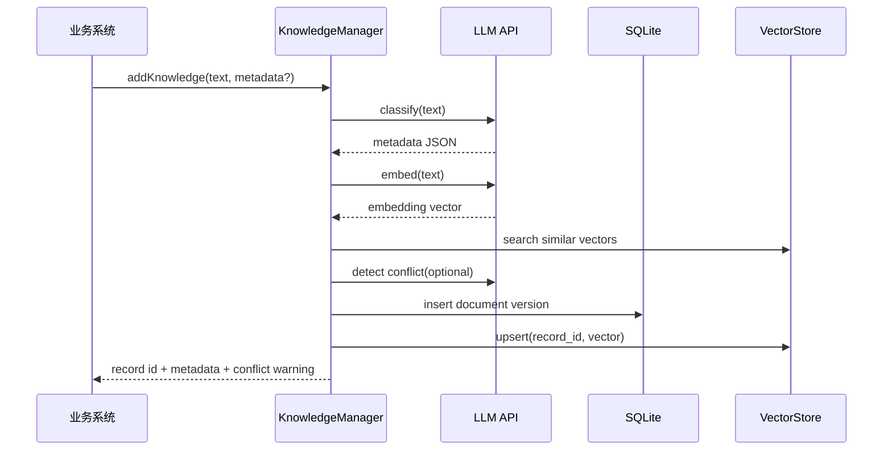
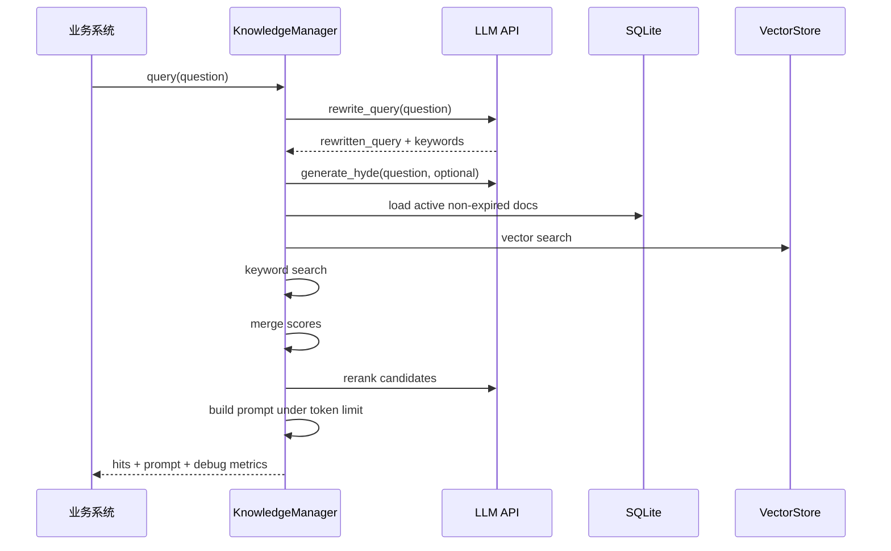

# 智能知识库管理与检索组件方案设计

## 1. 目标与边界

目标是实现一个轻量级智能知识库组件，为智能客服、产品问答、内部知识助手等 RAG 应用提供统一的知识入库和检索能力。

核心能力：

- 智能分类：使用 LLM 为纯文本/Markdown 生成结构化元数据。
- 存储管理：保存原文、元数据、版本、过期时间和向量。
- 智能检索：使用关键词 + 向量混合召回，结合查询改写、重排和 Prompt 组装。
- 验证闭环：提供分类、检索、对比实验、边界性能测试和指标落盘。

边界：

- 只处理纯文本/Markdown，不解析 PDF、Word。
- 不实现完整聊天机器人，只返回检索结果和 Prompt；RAG 对比脚本可调用下游 LLM 生成答案。
- 默认本地轻量部署，向量库使用 JSON 文件，后续可替换为 Chroma、FAISS、Milvus。

## 2. 整体架构



## 3. 入库流程



## 4. 查询流程



## 5. 分类设计

分类字段：

| 字段 | 说明 |
| --- | --- |
| `business_domain` | 业务域，如 customer_service、product、policy、technical、finance |
| `knowledge_type` | 知识类型，如 faq、policy、procedure、case、product_doc |
| `importance` | 重要程度，low、medium、high |
| `expire_at` | 过期时间，无法判断时为 null |
| `tags` | 关键词标签 |
| `summary` | 一句话摘要 |
| `confidence` | 分类置信度 |
| `needs_review` | 低置信度时进入人工复核 |

分类 Prompt 要求 LLM 只返回严格 JSON。低于 `0.65` 的分类置信度标记 `needs_review=true`。人工传入的 metadata 会覆盖模型分类结果，方便保留来源、负责人、权限等业务字段。

## 6. 存储结构设计

SQLite 文档表：

```sql
CREATE TABLE knowledge_documents (
  id TEXT PRIMARY KEY,
  logical_id TEXT NOT NULL,
  version INTEGER NOT NULL,
  text TEXT NOT NULL,
  metadata_json TEXT NOT NULL,
  status TEXT NOT NULL,
  created_at TEXT NOT NULL,
  updated_at TEXT NOT NULL
);
```

设计说明：

- `id`：版本级唯一 ID，格式为 `{logical_id}:v{version}`。
- `logical_id`：同一知识的稳定 ID。
- `version`：版本号，更新时自增。
- `metadata_json`：分类元数据、人工 metadata、冲突提示等扩展字段。
- 检索只召回每个 `logical_id` 的最新 active 版本。
- `expire_at` 小于当前日期时默认不参与检索。

向量存储当前使用 `data/vectors.json` 保存 `{record_id: embedding}`。该方案零部署、透明易验收，但入库性能随数据量增长变慢；后续工程化建议替换为 Chroma 或 FAISS。

## 7. 检索策略

1. 查询改写：LLM 将用户问题改写成独立检索问题并抽取关键词；失败时使用原问题。
2. HyDE：可选启用，先生成假设答案，再参与语义检索。
3. 向量召回：使用改写问题和 HyDE 文本生成向量。
4. 关键词召回：使用改写问题、HyDE 文本和关键词构建查询。
5. 混合排序：

```text
final_score = 0.65 * vector_score + 0.35 * keyword_score
```

6. LLM 重排：可选启用，失败时按混合分数排序。
7. Prompt 组装：包含来源、业务域、知识类型、分数、标签和正文。
8. Token 控制：中文按约 2 字符一个 token、英文按约 4 字符一个 token 估算，超过上限的片段跳过。

## 8. LLM API 与降级策略

默认使用 BigModel OpenAI-compatible API：

- Base URL：`https://open.bigmodel.cn/api/paas/v4`
- Chat model：`glm-4.7-flash`
- Embedding model：`embedding-3`

可配置开关：

| 配置 | 作用 | 默认 |
| --- | --- | --- |
| `ENABLE_LLM` | 是否启用 LLM API | true |
| `ENABLE_EMBEDDING_API` | 是否启用 Embedding API | true |
| `ENABLE_QUERY_REWRITE` | 是否启用查询改写 | true |
| `ENABLE_RERANK` | 是否启用结果重排 | true |
| `ENABLE_HYDE` | 是否启用 HyDE | false |
| `ENABLE_CONFLICT_CHECK` | 是否启用冲突检测 | false |
| `API_RETRY_ATTEMPTS` | API 重试次数 | 2 |
| `API_RETRY_BACKOFF_SECONDS` | 退避基准秒数 | 2.0 |

任何 API 调用失败时，系统会降级到 fallback：规则分类、本地关键词、哈希向量、分数排序。这样可保证本地演示和自动评估可复现。

## 9. 可观测性

当前记录并可导出 JSON：

- 入库耗时。
- 分类置信度。
- 是否需要人工复核。
- 是否检测到冲突。
- 查询耗时。
- 命中文档数量。
- Prompt 估算 token 数。

## 10. 验证方案

| 验证项 | 脚本 | 说明 |
| --- | --- | --- |
| 检索评估 | `scripts/evaluate.py --fallback` | 6 个固定查询，统计 Hit@1、Hit@3 |
| 分类评估 | `scripts/evaluate_classification.py --fallback` | 24 条样本业务域准确率 |
| 边界测试 | `scripts/benchmark.py --copies N` | 扩展到 480/1008 条测试性能 |
| 真实 API 验证 | `scripts/api_smoke_test.py` | 小样本验证 GLM 分类、Embedding、查询改写 |
| RAG 对比 | `scripts/rag_comparison.py --sleep 5` | 直接 LLM vs RAG 回答 |

## 11. 当前完成度

| 原始题目要求 | 当前状态 |
| --- | --- |
| 方案设计文档 | 已完成 Markdown，可导出 PDF |
| 整体架构图和数据流图 | 已完成 Mermaid 图 |
| 分类 Prompt 与 JSON 输出 | 已完成 |
| 存储 Schema、向量方案、版本和过期 | 已完成 |
| 混合检索、Prompt 模板、Token 控制 | 已完成 |
| `KnowledgeManager` 核心接口 | 已完成 |
| LLM API + Embedding API | 已接入并通过 smoke test |
| 轻量级向量存储 | 已完成 JSON 实现 |
| 20-30 条样本文档 | 已完成 24 条 |
| 功能验证 | 已完成 |
| 对比实验 | 已完成脚本和一次真实 API 运行记录 |
| 边界测试 | 已完成 480 和 1008 条 |
| 可观测性 | 已完成基础指标落盘 |
| HyDE | 已实现，可配置启用 |
| 知识冲突检测 | 已实现，可配置启用 |

## 12. 验证结果摘要

| 验证项 | 当前结果 |
| --- | --- |
| 检索评估 | Hit@1=1.0，Hit@3=1.0 |
| 分类评估 | 业务域准确率=0.958，标注类型准确率=1.0 |
| 480 条 benchmark | 平均查询耗时约 109.942 ms |
| 1008 条 benchmark | 平均查询耗时约 272.018 ms |
| API smoke test | GLM-4.7-Flash 分类、Embedding、查询改写、检索成功 |
| RAG 对比 | 3 条中 1 条 RAG 回答成功，2 条受 429 限流影响 |

## 13. 已知问题与风险

1. **BigModel 免费模型限流明显**
   - smoke test 成功，但 RAG 对比中出现 `429`。
   - 当前通过重试、退避、fallback 和脚本限流控制风险。

2. **JSON 向量库入库性能一般**
   - 1008 条时平均入库约 176 ms/条。
   - 工程化建议替换 Chroma/FAISS。

3. **Token 控制为估算版**
   - 适合轻量验收，但与真实 tokenizer 有误差。

4. **关键词索引每次查询重建**
   - 千级可接受，更大规模应改为增量索引。

## 14. GLM-4.7-Flash 可用性判断

当前不能判断 GLM-4.7-Flash “不能用”。更准确结论是：

- 接入路径正确，真实 API smoke test 已成功。
- 该模型或当前账户存在免费额度/并发限流，RAG 对比中出现 `429`。
- 最终报告应同时给出真实 API 成功记录和限流风险。
- fallback 结果用于证明项目在本地可稳定复现。

## 15. 后续工程化方向

- 使用 Chroma/FAISS 替换 JSON 向量库。
- 接入真实 tokenizer。
- 增加 FastAPI 服务接口。
- 增加人工反馈闭环和动态分类规则。
- 将评估结果生成 HTML/PDF 报告。
