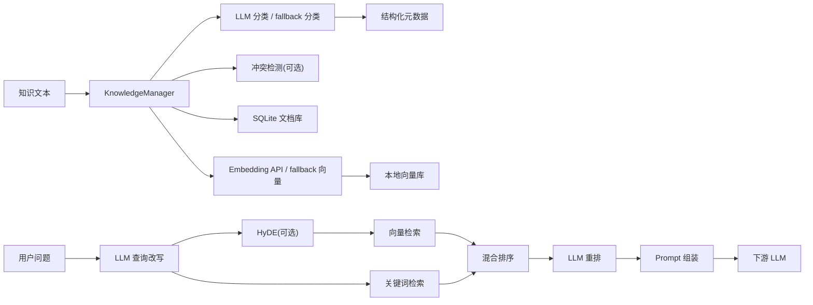
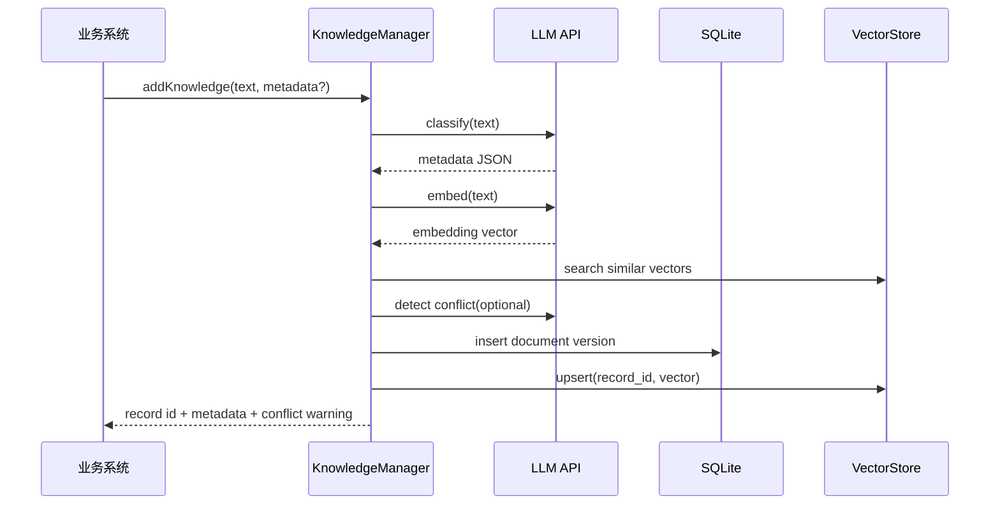

# 基于大模型的智能知识库管理与检索组件

## 一、项目背景

互联网业务团队在开发智能客服、产品问答、内部知识助手等 AI 应用时，需要将 FAQ、产品文档、规章制度、历史案例等内部知识注入大模型。传统知识库常见问题包括分类混乱、检索召回率低、知识更新滞后，导致大模型回答不准确或产生幻觉。

本项目设计并实现一个轻量级智能知识库管理与检索组件，围绕知识分类、存储和检索三个核心环节，构建可复用的 RAG 能力。

## 二、建设目标

项目目标包括：

1. 支持纯文本和 Markdown 知识入库。
2. 使用大模型自动生成结构化分类元数据。
3. 支持知识增删改查、版本管理和基础过期机制。
4. 将知识文本向量化存储，支持语义检索。
5. 支持关键词 + 向量混合检索。
6. 使用大模型进行查询改写和结果重排。
7. 组装带来源、分数和上下文的高质量 Prompt。
8. 提供功能验证、对比实验、边界测试和关键指标数据。

## 三、整体架构设计

系统采用轻量级 RAG 架构，对外提供 `KnowledgeManager` 服务。

核心接口：

```python
KnowledgeManager.addKnowledge(text, metadata?)
KnowledgeManager.query(question)
```

整体流程：

```text
知识文本
 -> LLM 自动分类
 -> 结构化元数据
 -> SQLite 文档存储
 -> Embedding 向量化
 -> 本地向量库

用户问题
 -> LLM 查询改写
 -> 可选 HyDE
 -> 向量检索 + 关键词检索
 -> 混合排序
 -> LLM 重排
 -> Prompt 组装
 -> 下游 LLM 回答
```

架构图：



## 四、知识入库流程

入库流程如下：

```text
输入文本
 -> LLM 分类
 -> 生成 metadata
 -> Embedding 向量化
 -> 相似知识召回
 -> 可选知识冲突检测
 -> 写入 SQLite
 -> 写入向量库
```

数据流图：



## 五、知识分类设计

分类由大模型完成，要求输出严格 JSON。分类维度如下：

| 字段 | 说明 |
| --- | --- |
| `business_domain` | 业务域，如 customer_service、product、policy、technical、finance |
| `knowledge_type` | 知识类型，如 faq、policy、procedure、case、product_doc |
| `importance` | 重要程度，low、medium、high |
| `expire_at` | 过期时间，无法判断时为 null |
| `tags` | 关键词标签 |
| `summary` | 一句话摘要 |
| `confidence` | 分类置信度 |
| `needs_review` | 是否需要人工复核 |

分类 Prompt 示例：

```text
You are a knowledge base classification assistant.
Read the knowledge text and return strict JSON only.

Required JSON schema:
{
  "business_domain": "customer_service|product|policy|sales|technical|hr|finance|operations|general",
  "knowledge_type": "faq|policy|procedure|case|product_doc|announcement|troubleshooting|document",
  "importance": "low|medium|high",
  "expire_at": "YYYY-MM-DD or null",
  "tags": ["short keywords"],
  "summary": "one sentence summary",
  "confidence": 0.0,
  "needs_review": true
}
```

不确定性处理：

- 当分类置信度低于 `0.65` 时，设置 `needs_review=true`。
- LLM API 调用失败时，系统降级到本地规则分类。
- 人工传入的 metadata 可覆盖模型分类结果。

## 六、存储结构设计

文档存储使用 SQLite，核心表结构如下：

```sql
CREATE TABLE knowledge_documents (
  id TEXT PRIMARY KEY,
  logical_id TEXT NOT NULL,
  version INTEGER NOT NULL,
  text TEXT NOT NULL,
  metadata_json TEXT NOT NULL,
  status TEXT NOT NULL,
  created_at TEXT NOT NULL,
  updated_at TEXT NOT NULL
);
```

字段说明：

| 字段 | 说明 |
| --- | --- |
| `id` | 版本级唯一 ID，格式为 `{logical_id}:v{version}` |
| `logical_id` | 同一知识的稳定 ID |
| `version` | 版本号，更新时自增 |
| `text` | 原始知识文本 |
| `metadata_json` | 分类元数据、人工 metadata、冲突提示等 |
| `status` | active / deleted |
| `created_at` | 创建时间 |
| `updated_at` | 更新时间 |

版本管理：

- 每次更新同一 `logical_id` 时生成新版本。
- 检索时只召回最新 active 版本。
- 历史版本保留，便于审计和回滚。

过期机制：

- `expire_at` 小于当前日期时，默认不参与检索。
- 过期文档仍保留在数据库中。

向量存储：

- 当前使用 `data/vectors.json` 保存 `{record_id: embedding}`。
- 优点是零部署、易演示、便于说明原理。
- 后续可替换为 Chroma、FAISS 或 Milvus。

## 七、检索策略设计

检索采用关键词 + 向量混合检索。

原因：

- 向量检索适合语义相近但措辞不同的问题。
- 关键词检索适合错误码、产品名、制度编号、专有名词等精确匹配。

查询流程：

```text
用户问题
 -> LLM 查询改写
 -> 关键词抽取
 -> 可选 HyDE
 -> 向量检索
 -> 关键词检索
 -> 分数融合
 -> LLM 重排
 -> Prompt 组装
```

混合分数：

```text
final_score = 0.65 * vector_score + 0.35 * keyword_score
```

其中向量分数权重更高，用于语义召回；关键词分数保留较高比例，用于强化专有名词和精确信息。

## 八、Prompt 组装设计

Prompt 包含：

- 用户问题
- 文档来源
- 业务域
- 知识类型
- 检索分数
- 标签
- 正文片段

Prompt 约束：

```text
You are a knowledge-grounded assistant. Answer using only the provided context.
If the context is insufficient, say what is missing instead of guessing.
```

Token 控制：

- 中文按约 2 字符一个 token 估算。
- 英文按约 4 字符一个 token 估算。
- 超过上限的知识片段会被跳过。

## 九、大模型 API 与 fallback 策略

默认大模型配置：

| 项 | 配置 |
| --- | --- |
| Base URL | `https://open.bigmodel.cn/api/paas/v4` |
| Chat Model | `glm-4.7-flash` |
| Embedding Model | `embedding-3` |

大模型参与环节：

| 环节 | 作用 |
| --- | --- |
| 分类 | 生成结构化元数据 |
| Embedding | 生成语义向量 |
| 查询改写 | 将模糊问题改写为独立检索问题 |
| 重排 | 对召回候选进行相关性排序 |
| HyDE | 生成假设答案辅助检索 |
| 冲突检测 | 判断新旧知识是否存在矛盾 |

fallback 机制：

- 分类 fallback：关键词规则分类。
- Embedding fallback：关键词哈希向量。
- 查询改写 fallback：使用原问题。
- 重排 fallback：按混合分数排序。

fallback 的作用是保证本地可复现，避免免费 API 限流导致系统不可运行。

## 十、验证方案

验证内容包括：

1. 功能验证：24 条样本文档入库、分类、检索。
2. 分类准确率：对业务域和知识类型进行统计。
3. 检索 Top-K：统计 Hit@1、Hit@3。
4. 对比实验：纯 LLM 直接回答 vs RAG 回答。
5. 边界测试：480 条和 1008 条知识规模下测试性能。
6. 关键指标：分类置信度、查询耗时、Prompt token 估算。

## 十一、验证报告

### 1. 样本数据

样本文档位于：

```text
data/samples/sample_documents.json
```

当前包含 24 条知识，覆盖客服售后、产品功能、HR、财务、技术接口、销售合同、运营活动和安全合规等领域。

### 2. 分类准确率

运行命令：

```bash
python scripts/evaluate_classification.py --fallback
```

结果：

| 指标 | 结果 |
| --- | --- |
| 文档数 | 24 |
| 业务域准确率 | 0.958 |
| 标注类型准确率 | 1.0 |
| 需人工复核样本 | sample-017 |

说明：`sample-017` 的权限管理说明被 fallback 分类为 `general`，置信度为 `0.62`，并设置 `needs_review=true`，符合低置信度人工复核设计。

### 3. 检索效果

运行命令：

```bash
python scripts/evaluate.py --fallback
```

固定查询集：

| 查询 | 期望文档 |
| --- | --- |
| 大额纸质专票多久寄出？ | sample-004 |
| API 返回 401 应该怎么处理？ | sample-005 |
| 客户忘记管理员密码怎么办？ | sample-015 |
| 免费版接口限流是多少？ | sample-024 |
| 合同到期前什么时候提醒客户经理？ | sample-014 |
| 数据库连接超时怎么排查？ | sample-012 |

结果：

| 指标 | 结果 |
| --- | --- |
| 查询数 | 6 |
| Hit@1 | 1.0 |
| Hit@3 | 1.0 |
| Prompt 估算 token | 约 448-501 |

检索效果示例：

```text
问题：API 返回 401 应该怎么处理？
Top1：sample-005
内容：API接口返回401通常表示访问令牌无效或已过期。调用方应重新获取token，并检查请求头Authorization格式是否为Bearer token。
```

### 4. 纯 LLM vs RAG 对比实验

运行命令：

```bash
python scripts/rag_comparison.py --sleep 5
```

结果摘要：

| 问题 | 纯 LLM 直接回答 | RAG 回答 | 说明 |
| --- | --- | --- | --- |
| 大额纸质专票多久寄出？ | 表示信息不可用 | 受 429 限流失败 | 已召回 sample-004 |
| API 返回 401 应该怎么处理？ | 给出通用处理流程 | 准确回答内部知识：重新获取 token 并检查 Authorization 格式 | RAG 更贴近内部文档 |
| 合同到期前什么时候提醒客户经理？ | 表示信息不可用 | 受 429 限流失败 | 已召回 sample-014 |

结论：

- 纯 LLM 对内部知识不一定知道，容易给出通用回答或表示信息不可用。
- RAG 回答成功时，能严格基于内部知识库内容，事实更贴近样本文档。
- BigModel 免费模型存在 429 限流，因此部分 RAG 回答被阻断。

### 5. 边界性能测试

运行命令：

```bash
python scripts/benchmark.py --copies 20
python scripts/benchmark.py --copies 42
```

结果：

| 数据规模 | 入库总耗时 | 平均入库耗时 | 平均查询耗时 | 最大查询耗时 |
| --- | --- | --- | --- | --- |
| 480 条 | 45.720 s | 95.249 ms/条 | 109.942 ms | 116.100 ms |
| 1008 条 | 177.834 s | 176.423 ms/条 | 272.018 ms | 461.390 ms |

结论：

- 千级知识规模下，本地 JSON 向量库仍可完成演示级查询。
- 入库耗时随规模增长明显，后续工程化建议替换为 Chroma/FAISS。

### 6. 真实 API 验证

运行命令：

```bash
python scripts/api_smoke_test.py
```

结果：

| 项 | 结果 |
| --- | --- |
| 模型 | `glm-4.7-flash` |
| Embedding | `embedding-3` |
| 分类结果 | technical / troubleshooting |
| 分类置信度 | 1.0 |
| 查询改写 | `HTTP 401 未授权错误处理方法` |
| Top1 来源 | api-smoke-001 |
| 入库耗时 | 约 26.893 s |
| 查询耗时 | 约 27.775 s |

结论：GLM-4.7-Flash 接入路径可用，已完成分类、Embedding、查询改写和检索链路验证。但免费模型存在限流和耗时波动。

## 十二、关键指标汇总

| 指标 | 当前结果 |
| --- | --- |
| 样本文档数 | 24 |
| 分类业务域准确率 | 0.958 |
| 标注类型准确率 | 1.0 |
| 检索 Hit@1 | 1.0 |
| 检索 Hit@3 | 1.0 |
| 480 条平均查询耗时 | 109.942 ms |
| 1008 条平均查询耗时 | 272.018 ms |
| Prompt 估算 token | 约 448-501 |
| 真实 API smoke test | 成功 |
| RAG 对比实验 | 1 条成功，2 条受限流影响 |

## 十三、风险与改进

| 风险 | 当前处理 | 后续建议 |
| --- | --- | --- |
| BigModel 免费模型限流 | API 失败时 fallback；脚本控制请求规模 | 增加更长退避、错峰运行，或切换稳定模型 |
| JSON 向量库写入慢 | 当前满足千级演示 | 替换为 Chroma/FAISS |
| Token 控制为估算 | 使用保守上限 | 接入真实 tokenizer |
| 关键词索引每次查询重建 | 千级可接受 | 增量索引或持久化索引 |

## 十四、最终结论

本项目已经完成题目要求的核心交付：

- 方案设计文档。
- 完整源码与 README。
- `KnowledgeManager` 核心接口。
- LLM 分类、Embedding、查询改写、结果重排。
- 本地存储、版本管理、过期过滤。
- 混合检索和 Prompt 组装。
- 24 条样本文档。
- Demo、功能验证、对比实验和边界测试。
- 可观测性基础指标。
- HyDE 和知识冲突检测加分能力。

项目可以作为最终提交版本。最终展示时建议说明：GLM-4.7-Flash 接入路径可用，但免费模型存在限流和耗时波动，因此项目保留 fallback 模式以保证本地可复现。
